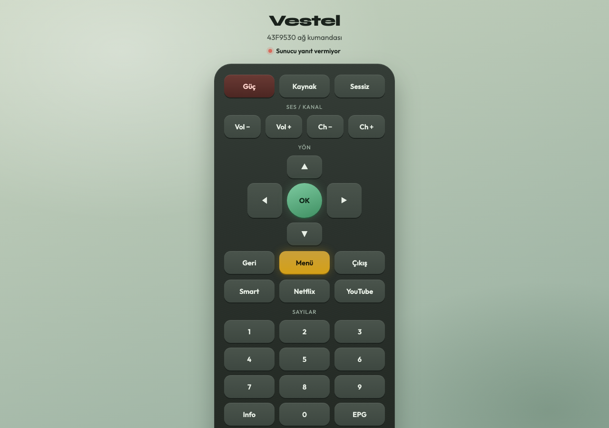

# Vestel 43F9530 PC Kumanda




Tarayıcıdan çalışan yerel ağ kumandası.

## Çalıştırma

```bash
cd ~/vestel-remote
python3 server.py
```

Sonra tarayıcıda açın: http://127.0.0.1:8765

## Gereksinimler

- TV açık ve Wi‑Fi’ye bağlı olmalı
- PC ile TV aynı ağda olmalı
- TV IP: `192.168.1.104` (`server.py` içinde değiştirilebilir)

## TV tarafı

Ayarlar → Diğer ayarlar → Medya / Ortam işleyici → **Açık**
